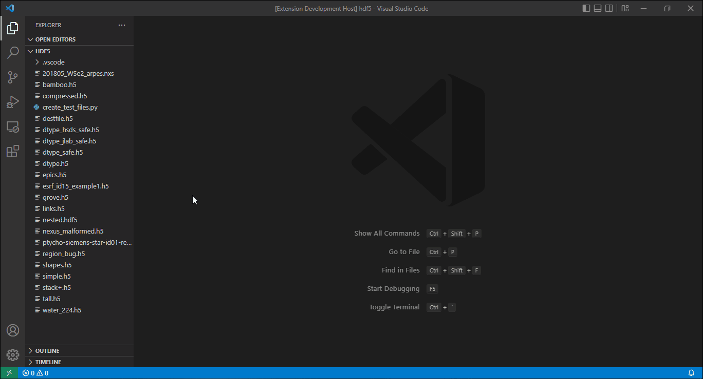
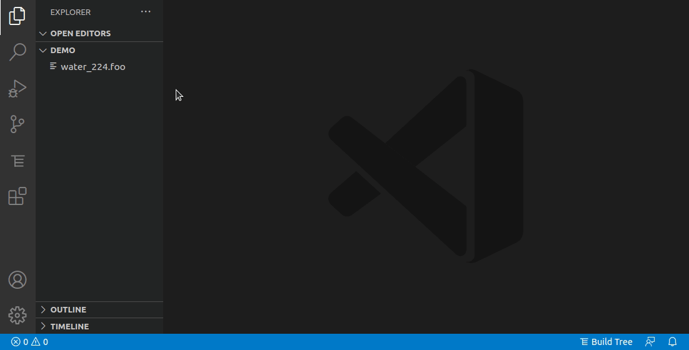

# [H5Web](https://h5web.panosc.eu/) for Visual Studio Code

Explore and visualise **HDF5 files** directly in Visual Studio Code with
[H5Web](https://h5web.panosc.eu/) and its `H5WasmProvider`.



## Supported HDF5 file extensions

Out of the box, the H5Web viewer is configured as the default editor for the
following file extensions: `.h5`, `.hdf`, `.hdf5`, `.nx`
([NeXus](https://manual.nexusformat.org/index.html)), `.nxs`, `.nx5`, `.nexus`,
`.cxi`
([Coherent X-ray Imaging](https://raw.githubusercontent.com/cxidb/CXI/master/cxi_file_format.pdf)),
`.nc` ([netCDF4](https://docs.unidata.ucar.edu/nug/current/)), `.nc4`.

To add more extensions, don't hesitate to
[open an issue](https://github.com/silx-kit/vscode-h5web/issues/new) or
[a pull request](https://github.com/silx-kit/vscode-h5web/pulls). Alternatively,
you can use VS Code's `workbench.editorAssociations` setting to set H5Web as the
default editor for additional extensions:

```json
"workbench.editorAssociations": {
  "*.foo": "h5web.viewer",
},
```

You can also open any file in H5Web with **right click -> Open with... -> H5Web
(any extension)**, or, if you've already opened the file, by invoking **View:
Reopen Editor With...** from the command palette:



Note that some of the extensions configured to open with H5Web are not
guaranteed to map to HDF5 files. For instance, the `.nc` extension is also used
for netCDF3 files, which are **not** based on HDF5 and are therefore not
compatible with H5Web. If this is an issue, you can use the
`workbench.editorAssociations` to restore the default editor association as
follows:

```json
"workbench.editorAssociations": {
  "*.nc": "default",
},
```

## Known limitations

This extension uses [h5wasm](https://github.com/usnistgov/h5wasm) to read HDF5
files and therefore suffers from the following limitations:

- External links cannot be resolved
- Datasets compressed with external filters (such as those of
  [hdf5plugin](https://github.com/silx-kit/hdf5plugin)) cannot be read
