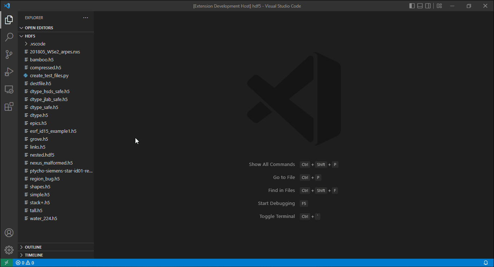
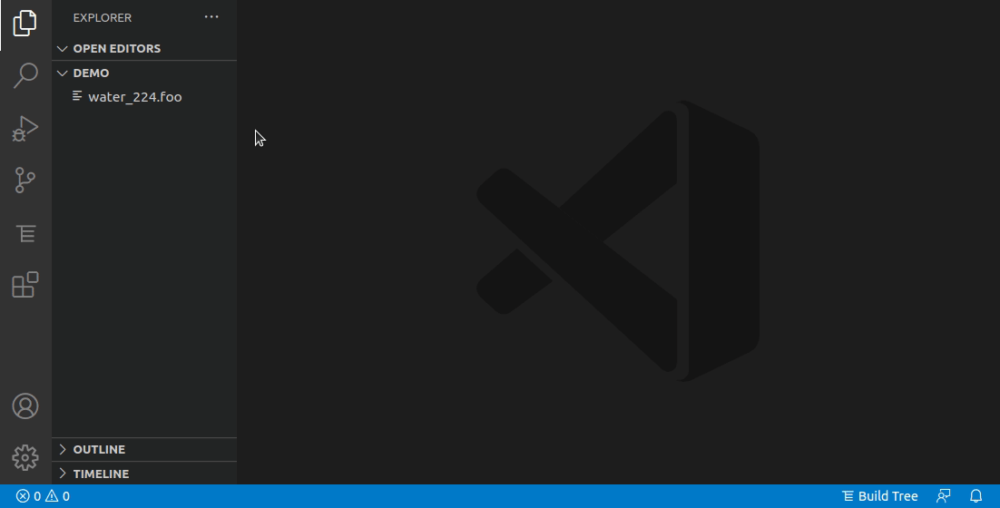

# [H5Web](https://h5web.panosc.eu/) for Visual Studio Code

Explore and visualise **HDF5 files** directly in Visual Studio Code with
[H5Web](https://h5web.panosc.eu/) and its `H5WasmProvider`.



## Supported HDF5 file extensions

Out of the box, the H5Web viewer is configured as the default editor for the
following file extensions: `.h5`, `.hdf`, `.hdf5`, `hf5`, `.nx`
([NeXus](https://manual.nexusformat.org/index.html)), `.nxs`, `.nx5`, `.nexus`,
`.cxi`
([Coherent X-ray Imaging](https://raw.githubusercontent.com/cxidb/CXI/master/cxi_file_format.pdf)),
`.nc` ([netCDF4](https://docs.unidata.ucar.edu/nug/current/)), `.nc4`,
[`.loom`](http://linnarssonlab.org/loompy/format/),
[`.jld2`](https://github.com/JuliaIO/JLD2.jl),
[`.h5ebsd`](https://link.springer.com/article/10.1186/2193-9772-3-4), `.edaxh5`,
`.oh5`,
[`.dream3d`](https://dream3d.bluequartz.net/Help/3_SupportedFileFormats/Native_DREAM3D_File_Format/),
[`.geoh5`](https://mirageoscience-geoh5py.readthedocs-hosted.com/en/v0.8.0/content/geoh5_format/index.html),
[`.h5oina`](https://github.com/oinanoanalysis/h5oina),
[`.h5ad`](https://anndata.readthedocs.io/en/latest/index.html),
[`.nde`](https://ndeformat.com/latest/).

To add more extensions, don't hesitate to
[open an issue](https://github.com/silx-kit/vscode-h5web/issues/new) or
[a pull request](https://github.com/silx-kit/vscode-h5web/pulls). Alternatively,
you can use VS Code's `workbench.editorAssociations` setting to set H5Web as the
default editor for additional extensions:

```json
"workbench.editorAssociations": {
  "*.foo": "h5web.viewer",
},
```

You can also open any file in H5Web with **right click -> Open with... -> H5Web
(any extension)**, or, if you've already opened the file, by
[switching editor type](https://code.visualstudio.com/updates/v1_132#_switch-editor-types)
(VS Code 1.132+) or invoking **View: Reopen Editor With...** from the command
palette:



Note that some of the extensions configured to open with H5Web are not
guaranteed to map to HDF5 files. For instance, the `.nc` extension is also used
for netCDF3 files, which are **not** based on HDF5 and are therefore not
compatible with H5Web. If this is an issue, you can use the
`workbench.editorAssociations` to restore the default editor association as
follows:

```json
"workbench.editorAssociations": {
  "*.nc": "default",
},
```

## Supported HDF5 compression plugins

The extension supports reading datasets compressed with any of the plugins
available in
[h5wasm-plugins@0.2.1](https://github.com/h5wasm/h5wasm-plugins/tree/v0.2.1?tab=readme-ov-file#included-plugins).

## Known limitations

This extension uses [h5wasm](https://github.com/usnistgov/h5wasm) to read HDF5
files and therefore suffers from the following limitations:

### Files bigger than 2GB cannot be opened automatically from the VS Code Explorer

They can still be viewed with the extension. When opening such a file, the H5Web
webview editor will request you to to browse and select it manually to open it.

### External links cannot be resolved

This is a limitation of [h5wasm](https://github.com/usnistgov/h5wasm) that the
extension uses to read HDF5 files.

### Incompatiblity with `snap` packages and Wayland on Linux

When using the extension to view datasets with a VS Code instance installed from
`snap`, you may encounter an error **Error creating WebGL context**.

This is an issue from VSCode `snap` package that
[forces the use of `XWayland/X11` instead of `Wayland`](https://github.com/microsoft/vscode/issues/207033).
Since it can not be worked around, our advice is use another VSCode installation
instead (e.g. via `apt`).
